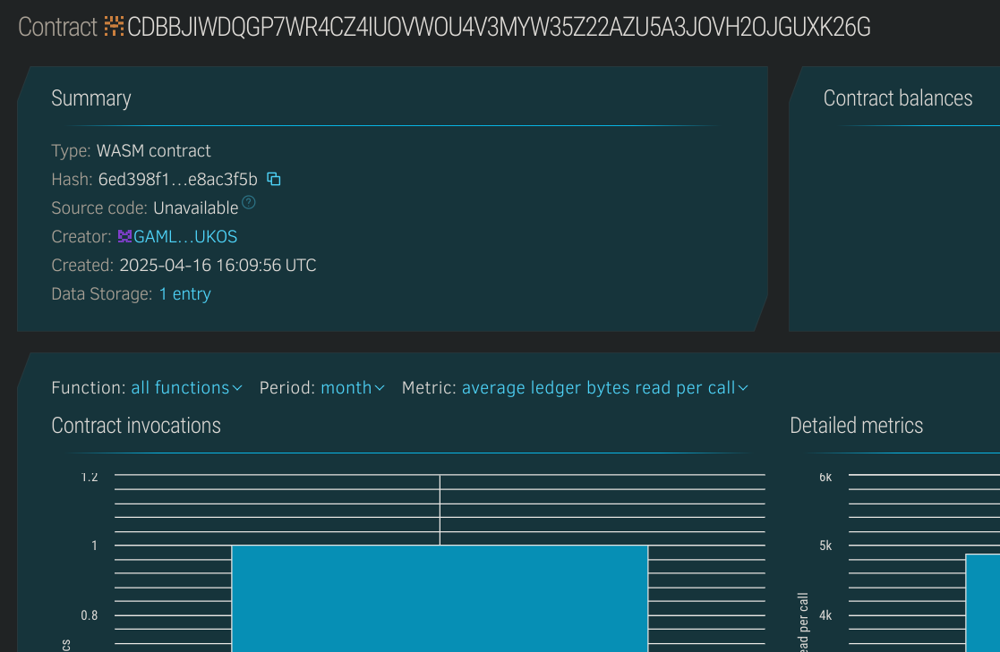

# Shared Expense Tracker

## Project Description
The **Shared Expense Tracker** is a smart contract built on the Stellar blockchain using Soroban that allows a group of users to record, split, and track shared expenses transparently. It ensures fair cost-sharing and accountability among group members.

## Project Vision
To simplify financial collaboration among friends, roommates, or teams by providing a transparent and decentralized method of tracking shared spending and balances.

## Key Features
- Create and manage expense groups.
- Add members to a group.
- Record expenses with payer and amount.
- Automatically split expenses equally among group members.
- View balances owed by or to each member.

## Future Scope
- Add multi-group membership for users.
- Support percentage-based or custom split logic.
- Integrate payment channels for automatic settlements.
- Add notifications and reminders for unpaid dues.

## Contract Details
CDBBJIWDQGP7WR4CZ4IUOVWOU4V3MYW35Z22AZU5A3JOVH2OJGUXK26G
